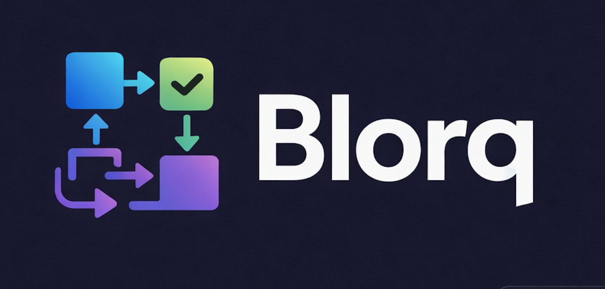

<div align="center">
  
  <h1>Blorq</h1>
  <p><strong>Production-grade, open-source log aggregator with RBAC, custom roles, multi-key API management, IP whitelisting, and real-time SSE streaming.</strong></p>
  <p>
    <a href="#quick-start">Quick Start</a> ·
    <a href="#api-reference">API Reference</a> ·
    <a href="#rbac--roles">RBAC</a> ·
    <a href="#api-key-management">API Keys</a> ·
    <a href="#security">Security</a> ·
    <a href="#file-layout">File Layout</a>
  </p>
</div>

---

## Features

| Feature | Details |
|---|---|
| **Log Ingestion** | Batch JSON log ingest via HTTP API with API key auth |
| **Real-time Stream** | SSE endpoint — live log feed to browser or curl |
| **Log Analytics** | Hourly charts, level breakdown, 7-day trend, top services |
| **API Analytics** | Per-endpoint latency (avg, P95, P99), error rates, trend analysis, heatmap |
| **RBAC** | Built-in admin/viewer + unlimited custom roles with per-page and per-card permissions |
| **API Key Management** | Multi-key with SHA-256 hashing, scopes, expiry, revoke — raw key shown once |
| **2FA (TOTP)** | Per-user optional TOTP via Google Authenticator / Authy |
| **IP Whitelist** | Restrict log ingest endpoint to specific IPs / /24 ranges |
| **User Management** | Create, delete, change roles, reset passwords, revoke 2FA — all in UI |
| **Role Config** | Visual per-role page + dashboard card permissions, custom role creation |
| **Health Page** | Memory, CPU, uptime, process info, Prometheus-style metrics endpoint |
| **Drag & Drop Dashboard** | Rearrange dashboard sections, order persisted in localStorage |

---

## Quick Start

```bash
# 1. Install dependencies
npm install

# 2. First-run setup (creates data/, .env, default users)
npm run setup

# 3. Start
npm start
# → http://localhost:9900

# Or in dev mode (auto-reload)
npm run dev
```

**Default credentials** (change after first login):

| Username | Password   | Role   |
|----------|------------|--------|
| admin    | admin123   | admin  |
| viewer   | viewer123  | viewer |

---

## File Layout

```
blorq/
├── config/
│   └── index.js          # All config (reads env vars + .env)
├── config.js             # Shim → config/index.js
│
├── controllers/          # req/res only — delegates to services
│   ├── AuthController.js
│   ├── LogController.js
│   ├── AnalyticsController.js
│   ├── ApiAnalyticsController.js
│   ├── ApiKeyController.js
│   ├── HealthController.js
│   ├── RoleConfigController.js
│   ├── SettingsController.js
│   ├── StreamController.js
│   ├── UiController.js   # All EJS page renders
│   └── UserController.js
│
├── services/             # All business logic
│   ├── AnalyticsService.js     # Log-level analytics (hourly, breakdown, trend)
│   ├── ApiAnalyticsService.js  # API request analytics (latency, errors, trend)
│   ├── ApiKeyService.js        # Multi-key management (create, hash, validate)
│   ├── AuthService.js          # JWT, bcrypt, TOTP/2FA
│   ├── LogService.js           # Ingest, tail, search, replay, download
│   ├── RoleConfigService.js    # RBAC — built-in + custom roles
│   ├── SettingsService.js      # Retention, webhook, stream, IP whitelist
│   └── UserService.js          # User CRUD
│
├── middleware/
│   ├── apiKey.js         # X-Api-Key validation (multi-key + legacy)
│   ├── auth.js           # JWT cookie authentication
│   ├── ipWhitelist.js    # IP whitelist (cached, /24 CIDR support)
│   ├── pageAccess.js     # UI page-level role guard
│   ├── rateLimit.js      # Sliding-window in-memory rate limiter
│   └── roles.js          # requireRole() middleware
│
├── routes/
│   ├── analytics.js      # GET /api/analytics/*
│   ├── api-analytics.js  # GET /api/api-analytics/*
│   ├── api-keys.js       # CRUD /api/api-keys  [admin]
│   ├── auth.js           # POST /api/auth/login|logout|...
│   ├── health.js         # GET  /api/health
│   ├── logs.js           # POST/GET /api/logs
│   ├── role-config.js    # GET/PUT/DELETE /api/role-config
│   ├── settings.js       # GET/POST /api/settings  [admin]
│   ├── stream.js         # GET /api/logs/stream  (SSE)
│   ├── ui.js             # All EJS page routes
│   └── users.js          # CRUD /api/users  [admin]
│
├── lib/
│   ├── batchWriter.js    # Buffered log file writes
│   ├── cleanup.js        # Log retention scheduler
│   ├── ejs.js            # Custom EJS renderer (canSee, hasCard injected)
│   ├── emitter.js        # EventEmitter for SSE
│   ├── logger.js         # Structured JSON logger
│   ├── streams.js        # WriteStream pool
│   ├── userStore.js      # users.json read/write
│   └── utils.js          # sanitize helpers, path traversal guard
│
├── views/
│   ├── partials/
│   │   ├── head.ejs      # Full CSS design system (dark/light)
│   │   └── sidebar.ejs   # Navigation — uses canSee() to hide inaccessible pages
│   ├── login.ejs
│   ├── dashboard.ejs     # Drag & drop — uses hasCard() per widget
│   ├── logs.ejs
│   ├── live.ejs          # SSE real-time stream
│   ├── insights.ejs      # Log + API analytics (two tabs, hasCard gated)
│   ├── health.ejs
│   ├── users.ejs         # User management
│   ├── api-keys.ejs      # API key management
│   ├── roles.ejs         # Custom role editor
│   ├── settings.ejs      # Settings incl. IP whitelist
│   └── 404.ejs
│
├── data/                 # Runtime data files (gitignored — mount as Docker volume)
│   ├── users.json        # Hashed passwords + roles
│   ├── settings.json     # Retention, webhook, stream, IP whitelist
│   ├── role-config.json  # Custom roles + permission overrides
│   └── api-keys.json     # API keys (SHA-256 hashed)
│
├── logs/                 # Ingested log files (gitignored)
│   └── {appName}/
│       └── {YYYY-MM-DD}.log
│       # API analytics logs land here as:
│       └── {appName}-requests/{date}.log
│
├── client/
│   └── logger.js         # Drop-in Express logger — ships logs to Blorq
│
├── server.js             # App bootstrap, route mounting
├── setup.js              # First-run setup
├── .env.example          # Environment variable reference
└── package.json
```

---

## API Reference

### Ingest Logs

```bash
POST /api/logs
X-Api-Key: blq_your_key_here
Content-Type: application/json

{
  "appName": "my-service",
  "logs": [
    "{\"level\":\"info\",\"message\":\"Server started\",\"appName\":\"my-service\"}",
    "{\"level\":\"error\",\"message\":\"DB timeout\",\"appName\":\"my-service\"}"
  ]
}
```

**Log format (structured JSON):**
```json
{
  "ts":        "2024-01-15T10:23:45.000Z",
  "level":     "error",
  "appName":   "my-service",
  "message":   "Database connection failed",
  "requestId": "abc-123",
  "duration":  1523
}
```

### Search Logs
```
GET /api/logs/search?service=myapp&date=2024-01-15&level=error&q=timeout
```

### Real-time Stream (SSE)
```bash
curl -H "Cookie: blorq_session=..." \
  "http://localhost:9900/api/logs/stream?level=error"
```

### Analytics
```
GET /api/analytics/overview
GET /api/analytics/hourly?service=myapp&date=2024-01-15
GET /api/analytics/levels?service=myapp&date=2024-01-15
GET /api/analytics/trend?service=myapp&days=7
GET /api/analytics/top-services?date=2024-01-15&top=10
GET /api/analytics/recent-errors?limit=20
```

### API Analytics
```
GET /api/api-analytics/services
GET /api/api-analytics/overview?service=myapp-requests&date=2024-01-15
GET /api/api-analytics/endpoints?service=myapp-requests&date=2024-01-15
GET /api/api-analytics/slow-trend?service=myapp-requests&start=2024-01-01&end=2024-01-15
GET /api/api-analytics/error-trend?service=myapp-requests&start=...&end=...
GET /api/api-analytics/hourly-pattern?service=myapp-requests&start=...&end=...
```

### Health
```
GET /api/health
GET /api/health/metrics    # Prometheus-style metrics
```

---

## RBAC & Roles

Blorq uses a three-layer permission system:

### 1. Page Access
Each role has a list of page IDs it can visit. Inaccessible pages are **hidden from the sidebar** — not just blocked. Attempting to visit a hidden URL redirects to `/dashboard`.

### 2. Dashboard Card Visibility  
Each role has a list of card IDs visible on the Dashboard and Insights pages. Cards not in the list simply don't render — there is no "Access Denied" placeholder.

### 3. Built-in Roles

| Role   | Pages | Cards |
|--------|-------|-------|
| admin  | All   | All   |
| viewer | Dashboard, Logs, Live, Insights | Core stats + charts |

### 4. Custom Roles

Create custom roles in the **Role Config** page (admin only):

1. Give the role a name (e.g. `operator`), a display label, and a colour
2. Check which pages and dashboard cards the role can access
3. Save — changes apply on the user's next login

Assign custom roles in **User Management**.

### 5. API via role-config endpoint
```bash
# List all roles
GET /api/role-config
Authorization: Cookie blorq_session=...

# Create/update a role
PUT /api/role-config/operator
Content-Type: application/json
{
  "label": "Operator",
  "color": "#f59e0b",
  "pages": ["dashboard","logs","insights"],
  "cards": ["stat-logs","stat-errors","chart-hourly","recent-errors"]
}

# Delete a custom role
DELETE /api/role-config/operator
```

---

## API Key Management

Blorq supports **multiple API keys** stored as SHA-256 hashes — the raw key is shown **once** on creation.

### Key format
All Blorq API keys begin with `blq_`:
```
blq_a1b2c3d4e5f6...  (68 chars total)
```

### Creating keys (UI)
1. Navigate to **API Keys** (admin only)
2. Click **New Key**
3. Give it a name, select scopes, optionally set an expiry
4. **Copy the key immediately** — it won't be shown again

### Creating keys (API)
```bash
POST /api/api-keys
Content-Type: application/json
Cookie: blorq_session=...

{
  "name": "prod-ingest",
  "scopes": ["logs:write"],
  "expiresAt": "2025-12-31T00:00:00Z"
}
```

### Available Scopes
| Scope | Permits |
|-------|---------|
| `logs:write` | POST /api/logs (ingest) |
| `logs:read` | GET /api/logs/* (search, tail, download) |
| `analytics:read` | GET /api/analytics/* and /api/api-analytics/* |
| `health:read` | GET /api/health/* |
| `stream:read` | GET /api/logs/stream |

### Using a key
```bash
X-Api-Key: blq_your_key_here
```

**Backward compatibility:** The legacy `API_KEY` env var still works — any key that doesn't start with `blq_` is matched against it.

---

## Security

### Auth
- JWT tokens stored in `httpOnly; sameSite=Strict` cookies
- bcrypt cost factor 12 for passwords
- Timing-safe comparison to prevent user enumeration
- TOTP/2FA via speakeasy (RFC 6238) with QR code setup

### API Keys
- SHA-256 hashed at rest — plaintext never stored
- Raw key returned exactly once on creation
- Per-key scope enforcement
- Expiry support

### IP Whitelist (log ingest only)
Restrict which IPs can push logs. Configured in **Settings → Security**:
- One entry per line
- Exact IP (`192.168.1.100`) or `/24` prefix (`10.0.0.0/24`)
- Empty = allow all (default)

The whitelist is applied only to `POST /api/logs` — the UI and analytics endpoints are not affected.

### Headers
- `helmet` with strict CSP
- `X-Request-Id` on every response
- Rate limiting: 10 login attempts / 15 min; 1000 log ingests / min

### Production checklist
```
✅ Set JWT_SECRET to ≥32 random chars
✅ Set API_KEY to something non-default
✅ NODE_ENV=production
✅ Mount data/ as a persistent volume (Docker)
✅ Put Blorq behind a reverse proxy with TLS
✅ Change default admin/viewer passwords
✅ Create per-service API keys with minimal scopes
```

---

## Express Logger (client/logger.js)

Drop Blorq's logger into any Express app to ship request metrics automatically:

```js
const logger = require('./client/logger');

// Configure once at startup
logger.configure({
  appName:           'my-api',
  remoteUrl:         'http://blorq:9900/api/logs',
  apiKey:            'blq_your_key',
  interceptConsole:  true,  // all console.log → Blorq
});

// In app.js, BEFORE your routes
app.use(logger.requestLogger());

// Structured logging
const log = logger.create({ service: 'PaymentService' });
log.info('Charge processed', { amount: 99 });
log.error('Stripe failed', new Error('Timeout'));
```

This ships request metrics to `logs/{appName}-requests/{date}.log`, visible in **Insights → API Analytics**.

---

## Docker

```dockerfile
FROM node:20-alpine
WORKDIR /app
COPY package*.json ./
RUN npm ci --omit=dev
COPY . .
RUN node setup.js
EXPOSE 9900
CMD ["node", "server.js"]
```

```yaml
# docker-compose.yml
services:
  blorq:
    build: .
    ports:
      - "9900:9900"
    volumes:
      - ./data:/app/data      # persist users, keys, roles, settings
      - ./logs:/app/logs      # persist log files
    environment:
      NODE_ENV: production
      JWT_SECRET: your-32-char-random-secret
      PORT: 9900
```

---

## License

MIT — free to use, modify, and distribute.
